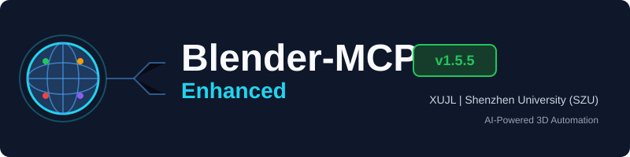
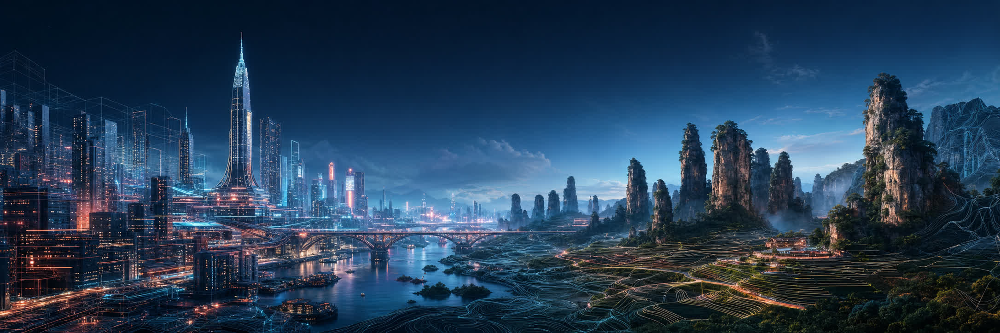
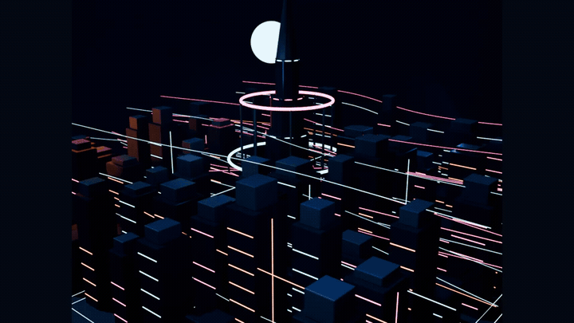
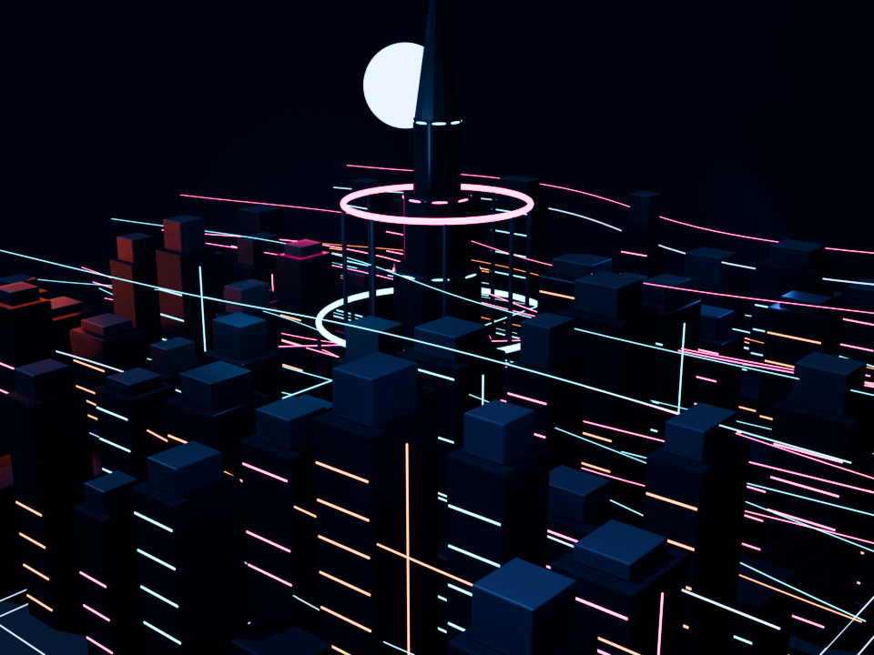
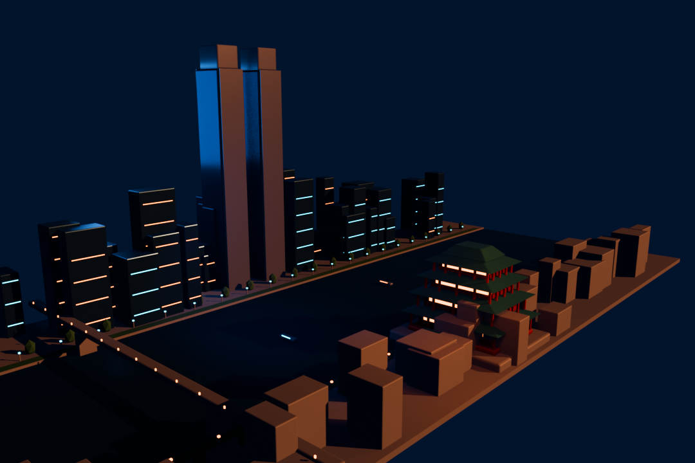
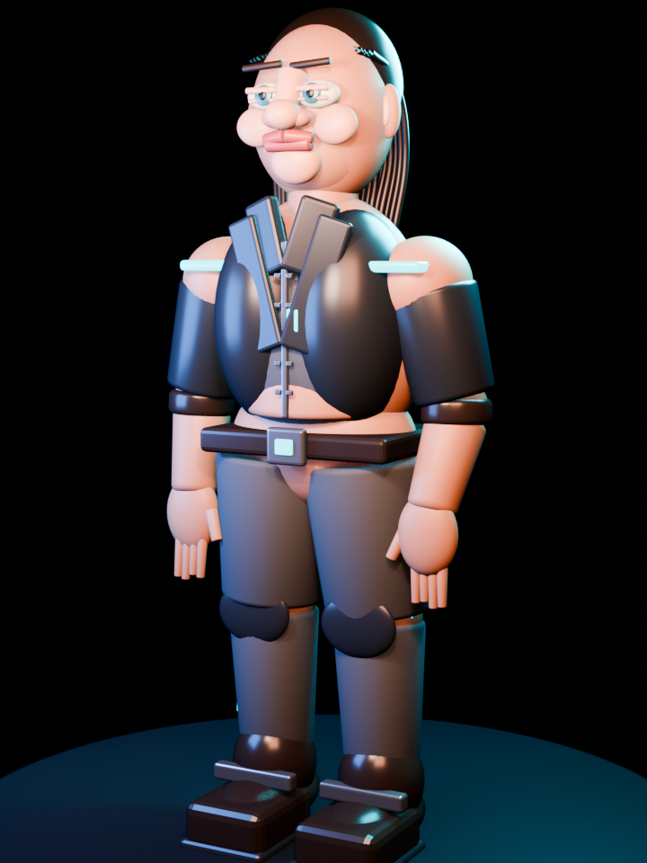

<div align="center">



### 世界を構築し、Blenderを動かし、不可能を作品にする。

`モデリング` · `マテリアル` · `アニメーション` · `レンダリング` · `自動化`

[English](README.md) | [简体中文](README.zh-CN.md) | [**日本語**](README.ja.md)

[](https://github.com/XUJL-916/blender-mcp-enhanced/releases)
[](docs/COMPATIBILITY_BLENDER_5_1_2.md)
[](tests)
[](LICENSE)

</div>



> **Blender MCP Enhanced** は、BlenderをAIエージェント対応の3D制作環境へ
> 拡張します。AIクライアントはModel Context Protocolを通して構造化ツールを
> 呼び出し、ローカルのBlenderアドオンがモデリング、マテリアル、アニメーション、
> レンダリング、アセット処理、永続的なバックグラウンドジョブを実行します。

カバーはプロジェクトのコンセプトアートです。以下のショーケース画像は、開発と
テスト中に実際に作成された `.blend` シーンのレンダーです。

## Showcase

<div align="center">
  <a href="assets/showcase/showreel.mp4">
    
  </a>
  <br />
  <sub>アニメーションをクリックすると軽量MP4を表示します。</sub>
</div>

<br />

<table>
  <tr>
    <td width="50%" align="center">
      
      <br /><strong>ネオン未来都市</strong><br />
      プロシージャルな街区、発光建築、カメラ、ライティング。<br />
      <a href="mcp_future_city.blend">.blend シーンを開く</a>
    </td>
    <td width="50%" align="center">
      
      <br /><strong>南昌のブルーアワー</strong><br />
      現代的なスカイラインと伝統建築を組み合わせた都市スタディ。<br />
      <a href="nanchang_city.blend">.blend シーンを開く</a>
    </td>
  </tr>
  <tr>
    <td colspan="2" align="center">
      
      <br /><strong>キャラクタースタディ</strong><br />
      レイヤー化された形状、マテリアル、スタジオ照明。<br />
      <a href="detailed_character.blend">.blend シーンを開く</a>
    </td>
  </tr>
</table>

## 主な機能

| 分野 | 機能 |
|---|---|
| モデリング | メッシュ編集、モディファイア、スカルプト、UV、ブーリアン、カーブ、計測 |
| ルック開発 | PBR、ノードグラフ、ライトリグ、レンダーパス、コンポジター |
| アニメーション | キーフレーム、Action、制約、アーマチュア、リグ、Blender 5.x FCurve互換 |
| シーン制作 | カメラ、コレクション、入出力、パッケージ、差分、ロールバック |
| 非同期処理 | レンダー、ベイク、ダウンロード、停止・再開、優先度、再試行、再起動復旧 |
| オーケストレーション | 依存DAG、CPU/GPUスロット、永続イベントカーソル |

## プロンプトから制作へ

```text
南昌のウォーターフロントをブルーアワーで構築する。都市のブロックアウト、
伝統的な楼閣、橋の照明、水面反射、3つのカメラを追加し、Cyclesでレンダーする。
```

```text
張家界を思わせる砂岩柱の地形を固定シードで生成する。侵食マスク、森林分布、
大気遠近、崖の道を追加し、GPU同時実行数1で3つのカメラをキューに入れる。
```

## クイックスタート

```bash
git clone https://github.com/XUJL-916/blender-mcp-enhanced.git
cd blender-mcp-enhanced
uv sync
```

1. Blenderの **Edit > Preferences > Add-ons** を開きます。
2. **Install from Disk** から [`addon.py`](addon.py) をインストールします。
3. **Blender MCP** を有効にし、サイドバーからポート `9876` のサーバーを起動します。
4. MCPクライアントに絶対パスを登録します。

```json
{
  "mcpServers": {
    "blender": {
      "command": "uv",
      "args": ["--directory", "C:/absolute/path/blender-mcp-enhanced", "run", "blender-mcp"]
    }
  }
}
```

## 非同期プロダクションキュー

```text
submit_async_job(kind="render", priority=50, resource="gpu", ...)
pause_async_job(job_id="...")
resume_async_job(job_id="...")
get_async_job_graph()
subscribe_async_job_events(after=cursor)
```

依存関係、指数バックオフ、CPU/GPU同時実行制限、Blender異常終了後の復旧に
対応しています。詳細は [Production Workflows](docs/PRODUCTION_WORKFLOWS.md) を参照してください。

## ドキュメント

- [User Guide](docs/USER_GUIDE.md)
- [API Documentation](docs/API_DOCUMENTATION.md)
- [Fine Modeling](docs/FINE_MODELING.md)
- [Production Workflows](docs/PRODUCTION_WORKFLOWS.md)
- [Blender 5.1 Compatibility](docs/COMPATIBILITY_BLENDER_5_1_2.md)
- [Troubleshooting](docs/TROUBLESHOOTING.md)
- [Developer Guide](docs/DEVELOPER_GUIDE.md)

## セキュリティ

`execute_blender_code` はBlender内でPythonを実行できます。信頼できるローカル環境で
使用し、TCPサーバーを公開インターネットへ直接公開しないでください。APIキーを
リポジトリへコミットしないでください。

## クレジット

[MIT License](LICENSE) で公開されています。
[Siddharth Ahuja / ahujasid](https://github.com/ahujasid/blender-mcp) の原プロジェクトと
Blender MCPコミュニティの成果を基盤としています。

<div align="center">

**ひとつのオブジェクトから、ひとつの世界へ。**

[Issues](https://github.com/XUJL-916/blender-mcp-enhanced/issues) ·
[Documentation](docs/USER_GUIDE.md) ·
[Demo](assets/showcase/showreel.mp4)

</div>
