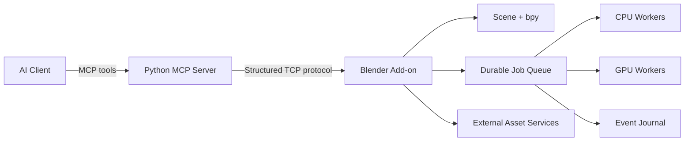

<div align="center">


### BUILD WORLDS. DIRECT BLENDER. SHIP THE IMPOSSIBLE.

`MODELING` · `MATERIALS` · `ANIMATION` · `RENDERING` · `AUTOMATION`

[**English**](README.md) | [简体中文](README.zh-CN.md) | [日本語](README.ja.md)

[](https://github.com/XUJL-916/blender-mcp-enhanced/releases)
[](docs/COMPATIBILITY_BLENDER_5_1_2.md)
[](pyproject.toml)
[](tests)
[](LICENSE)

</div>


> **Blender MCP Enhanced** turns Blender into an agent-ready 3D production
> environment. AI clients communicate through the Model Context Protocol while
> a local Blender add-on performs structured modeling, materials, animation,
> rendering, asset operations, and durable background jobs.

The cover is project concept art. Every image in the showcase below is an actual
render from a `.blend` scene created while developing and testing this project.

## See It Build

<div align="center">
  <a href="assets/showcase/showreel.mp4">
    
  </a>
  <br />
  <sub>Click the animation for the lightweight MP4 version.</sub>
</div>

<br />

<table>
  <tr>
    <td width="50%" align="center">
      
      <br /><strong>Neon Future City</strong><br />
      Procedural blocks, emissive architecture, camera and lighting.<br />
      <a href="mcp_future_city.blend">Open the .blend scene</a>
    </td>
    <td width="50%" align="center">
      
      <br /><strong>Nanchang at Blue Hour</strong><br />
      A city study combining a modern skyline and traditional pavilion.<br />
      <a href="nanchang_city.blend">Open the .blend scene</a>
    </td>
  </tr>
  <tr>
    <td colspan="2" align="center">
      
      <br /><strong>Detailed Character Study</strong><br />
      Layered hard-surface forms, materials, studio lighting and close-up detail.<br />
      <a href="detailed_character.blend">Open the .blend scene</a>
    </td>
  </tr>
</table>

## Why This Fork

This project keeps the directness of the original Blender MCP bridge and expands
it into a more complete production toolkit:

| Area | What is included |
|---|---|
| Structured modeling | Mesh editing, modifiers, sculpt helpers, UV tools, booleans, curves, typography and measurement |
| Look development | PBR materials, complete node-graph editing, lighting rigs, render passes and compositor control |
| Animation | Keyframes, actions, constraints, armatures, character rigging and Blender 5.x FCurve compatibility |
| Scene production | Cameras, collections, import/export, packaging, cleanup, snapshots, diffs and rollback-aware recipes |
| Long-running jobs | Async render, bake and download queue with pause/resume, priorities, retries and restart recovery |
| Workflow orchestration | Dependency DAGs, CPU/GPU slots, durable event cursors and structured errors |
| Asset ecosystems | Poly Haven, Sketchfab, BlenderKit, Hyper3D and Hunyuan3D integration surfaces |

## Imagine the Prompt

The same tool surface can drive precise hard-surface work or large environmental
studies. These are representative workflow prompts, not one-click canned scenes:

```text
Build a cinematic Nanchang waterfront at blue hour. Block the skyline first,
then add a traditional pavilion, bridge lighting, river reflections, three
camera options, and render the selected view in Cycles.
```

```text
Create a Zhangjiajie-inspired sandstone pillar terrain from a deterministic
seed. Add erosion masks, forest distribution, atmospheric depth, a cliff path,
and queue three camera renders with a GPU resource limit of one.
```

```text
Generate a terrain study from DEM height data, build LOD variants, bake normal
and ambient-occlusion maps, package dependencies, and export a clean GLB.
```

## Architecture



- **243 passing tests** across protocol, recovery, modeling and production tools.
- Request/response limits, redacted sensitive logging and structured errors.
- Context preservation and rollback-aware multi-step operations.
- Blender 5.1.2 is the primary verified target; Python 3.10+ is supported by the MCP server.

## Quick Start

### 1. Install the Python server

```bash
git clone https://github.com/XUJL-916/blender-mcp-enhanced.git
cd blender-mcp-enhanced
uv sync
```

`pip install -e .` also works with Python 3.10 or newer.

### 2. Install the Blender add-on

1. Open **Blender > Edit > Preferences > Add-ons**.
2. Choose **Install from Disk** and select [`addon.py`](addon.py).
3. Enable **Blender MCP**.
4. Open the Blender MCP sidebar panel and start the local server on port `9876`.

### 3. Register the MCP server

Use an absolute path in your MCP client configuration:

```json
{
  "mcpServers": {
    "blender": {
      "command": "uv",
      "args": [
        "--directory",
        "C:/absolute/path/to/blender-mcp-enhanced",
        "run",
        "blender-mcp"
      ]
    }
  }
}
```

Start Blender's add-on server before asking the client to use Blender tools.

## Async Production Queue

Long renders, texture bakes and downloads do not need to block the main Blender
connection. Jobs expose progress, outputs, bounded logs and durable state.

```text
submit_async_job(kind="render", priority=50, resource="gpu", ...)
pause_async_job(job_id="...")
resume_async_job(job_id="...")
get_async_job_graph()
subscribe_async_job_events(after=cursor)
```

The queue supports dependencies through `depends_on`, exponential retries,
CPU/GPU concurrency limits and recovery after an abnormal Blender restart. See
[Production Workflows](docs/PRODUCTION_WORKFLOWS.md) for the complete contract.

## Documentation

| Guide | Purpose |
|---|---|
| [User Guide](docs/USER_GUIDE.md) | Installation and daily workflows |
| [API Documentation](docs/API_DOCUMENTATION.md) | Tool and protocol reference |
| [Fine Modeling](docs/FINE_MODELING.md) | Precision modeling tool surface |
| [Production Workflows](docs/PRODUCTION_WORKFLOWS.md) | Queue, rollback, rendering and packaging |
| [Blender 5.1 Compatibility](docs/COMPATIBILITY_BLENDER_5_1_2.md) | Verified API behavior |
| [Troubleshooting](docs/TROUBLESHOOTING.md) | Connection and runtime diagnostics |
| [Developer Guide](docs/DEVELOPER_GUIDE.md) | Architecture and contribution notes |

## Development

```powershell
.\.venv\Scripts\python.exe -m py_compile addon.py src\blender_mcp\server.py
.\.venv\Scripts\python.exe -m pytest tests -q
```

Some integration workflows require a running Blender instance. Local API keys
belong in environment variables or an untracked `src/blender_mcp/config.py`.
Start from [`config.py.example`](src/blender_mcp/config.py.example).

## Security

This is a powerful local automation bridge. `execute_blender_code` can execute
Python inside Blender, and job tools can access local paths. Keep the TCP add-on
bound to a trusted local environment, do not expose it directly to the public
internet, and never commit API keys.

## Credits and License

Blender MCP Enhanced is released under the [MIT License](LICENSE). It builds on
the original work by [Siddharth Ahuja / ahujasid](https://github.com/ahujasid/blender-mcp)
and the wider Blender MCP community.

<div align="center">

**From a single object to an entire world, keep the creative loop inside Blender.**

[Report an issue](https://github.com/XUJL-916/blender-mcp-enhanced/issues) ·
[Explore the docs](docs/USER_GUIDE.md) ·
[Watch the demo](assets/showcase/showreel.mp4)

</div>
