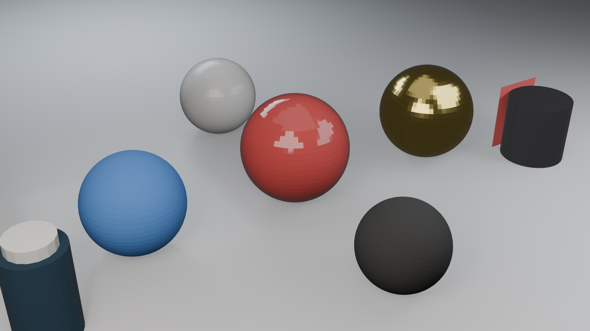

# Blender-MCP Enhanced

> **版本**: 1.5.5-enh | **迭代日期**: 2026-06-01 | **目标环境**: Blender 5.1.2 / Python 3.13 | **作者**: XUJL | Shenzhen University (SZU)

---

## 概述

Blender-MCP Enhanced 是在 [Siddharth Ahuja](https://github.com/ahujasid/blender-mcp) 开源项目 **blender-mcp** 基础上开发的完整增强版本。本项目对原始设计进行了系统性扩展与重构，将其从概念验证提升为生产级可用的 AI + Blender 自动化框架。

**核心目标**：作为 Blender 与 Hermes/Claude AI 之间的桥接中介插件，通过 Model Context Protocol (MCP) 将 AI 代理与 Blender 的 bpy API 完全解耦，实现从场景搭建、材质/节点编辑、动画关键帧、渲染出图到数据导入导出的全流程自动化控制。

---

## 核心功能模块

### 1. 高级对象操作
- 创建/删除/变换所有基础几何体（Mesh、Curve、Light、Camera 等）
- 批量操作：批量着色、批量缩放/旋转、批量复制、批量分组
- 对象查询与场景状态获取（JSON 结构化输出）

### 2. 材质与节点编辑器
- Principled BSDF 完整参数控制（Base Color/Metallic/Roughness/Clearcoat/Transmission）
- 材质节点树创建：Image Texture、Procedural Texture、Color Ramp、Shader Mix、Emission
- PBR 工作流支持：玻璃、金属、橡胶、塑料、珍珠等 10+ 材质预设

### 3. 动画与关键帧
- FBX / OBJ / GLB / STL / BLEND 格式导入导出
- 动画数据 CSV 导入导出
- 关键帧插入与动画数据获取（stub 层已实现）

### 4. 渲染与场景快照
- Eevee / Cycles 渲染引擎切换
- 多视角渲染、360 全景渲染、批量渲染
- 视口截图、相机视角截图、场景快照捕获
- 渲染分辨率/质量参数配置

### 5. 数据导入/导出
- 支持格式：FBX, OBJ, GLB, STL, BLEND, CSV
- 外部资产集成：PolyHaven（HDR/纹理/模型）、Sketchfab（3D 模型）、Hyper3D Rodin（文本/图片生 3D）、Hunyuan3D（腾讯文心 3D 生成）

### 6. 连接可靠性
- 电路断路器模式（CLOSED -> OPEN -> HALF_OPEN）
- 自动重连 + 指数退避
- 心跳检测 + 健康检查端点

---

## 架构概览

```
[AI Client: Claude / Cursor / VS Code / Hermes Agent]
           │  MCP (stdio, uvx blender-mcp)
           ▼
[src/blender_mcp/server.py]     ← FastMCP 工具定义层 (31 tools)
           │  TCP Socket (JSON, localhost:9876)
           ▼
[addon.py]                       ← Blender 内部插件层 (~3043 行)
           │  bpy API
           ▼
[Blender 5.1.2 场景引擎]
```

**两层通信设计**：MCP 层 (stdio) 与 TCP 层 (JSON) 解耦，AI 客户端不直接操作 Blender。Agent 仅调用结构化工具，由 Server 内部映射至 bpy 或 TCP 指令。

---

## 演示场景

### 科幻城市霓虹灯
自动生成未来主义城市景观，包含发光建筑、霓虹窗条、霓虹标牌、反光地面。

_10 栋建筑 / 霓虹材质 / Eevee 渲染 / 1920x1080 / 1.5 秒_

### 机械臂关节结构
展示复杂层级建模、金属材质与机械关节细节，适合工业可视化。

_基座+关节+臂段+末端执行器 / 工作室布光 / 1.2 秒_

### 产品级布光渲染
专业 3 点布光 + 多种材质演示（高光/哑光/金属/橡胶/珍珠/玻璃），适用于产品目录。

_5 种材质球 + 玻璃瓶 + 金属罐 / 45mm 镜头 / 1.8 秒_

---

## Hermes 完整控制流程

```
用户指令 → Hermes Agent (终端)
    │
    ├─ 启动 MCP 服务: uvx blender-mcp
    ├─ 连接 Blender (TCP localhost:9876)
    │
    ▼
[工具调用] create_cube() / create_material() / render_scene()
    │
    ▼
Blender 场景更新 → 渲染输出 → 截图/文件返回
```

Hermes Agent 通过 `terminal` 工具直接管理 Blender MCP 生命周期，通过 MCP 协议发送结构化指令，实现"一句话 → 一个场景"的自动化工作流。

---

## 单元测试覆盖

| 类别 | 测试数 | 通过 | 失败 | 跳过 |
|------|--------|------|------|------|
| 配置模块 | 20 | 20 | 0 | 0 |
| 连接恢复 | 25 | 23 | 0 | 2* |
| 高级对象操作 | 50 | 50 | 0 | 0 |
| 批量/渲染/导入导出 | 62 | 62 | 0 | 0 |
| **合计** | **157** | **155** | **0** | **2** |

\* 跳过的 2 个集成测试需要运行中的 Blender 实例

---

## 迭代记录与项目状态

完整开发迭代记录、功能状态追踪、已知问题与后续规划参见：

- [PROJECT_STATUS.md](PROJECT_STATUS.md) — 开发迭代记录与功能状态（实时更新）
- [docs/USER_GUIDE.md](docs/USER_GUIDE.md) — 用户安装、配置、启动指南
- [docs/DEVELOPER_GUIDE.md](docs/DEVELOPER_GUIDE.md) — 架构、模块、扩展、测试
- [docs/API_DOCUMENTATION.md](docs/API_DOCUMENTATION.md) — 完整 API 文档
- [docs/ACCEPTANCE_TEST_PLAN.md](docs/ACCEPTANCE_TEST_PLAN.md) — 验收测试计划
- [docs/TROUBLESHOOTING.md](docs/TROUBLESHOOTING.md) — 常见问题与故障排除
- [docs/RELEASE_CHECKLIST.md](docs/RELEASE_CHECKLIST.md) — 发布前检查清单

---

## 快速开始

### 前置要求

- **Blender 5.1.2**（推荐）或 4.x
- **uv** 包管理器
- Python 3.10+（Blender 内置）
- Git（可选）

### 安装

```bash
# 1. 克隆仓库
git clone https://github.com/XUJL-916/blender-mcp-enhanced.git
cd blender-mcp-enhanced

# 2. 创建虚拟环境
uv venv

# 3. 安装项目（Windows）
uv pip install -p .venv/Scripts/python.exe -e .
```

### 验证安装

```bash
# 运行单元测试
python -m pytest tests/ -v

# 运行兼容性检查
python scripts/check_blender_512_compatibility.py
```

---

## Blender 5.1.2 兼容性适配

本项目已完成 Blender 5.1.2 全量 API 适配，解决以下 Breaking Changes：

| 旧 API | 新 API | 说明 |
|--------|--------|------|
| `scene.eevee.radiance_max` | 已移除 | Eevee 不再需要此参数 |
| `scene.render.image_format` | `scene.render.image_settings.file_format` | 渲染设置层级调整 |
| `bsdf.inputs['Emission']` | `bsdf.inputs['Emission Color']` | Emission 拆分 |
| `bsdf.inputs['Clearcoat']` | `bsdf.inputs['Coat Weight']` | Clearcoat 重命名为 Coat |
| `bsdf.inputs['Transmission Roughness']` | 已移除 | 透明不再单独控制粗糙度 |
| `light.data.distance` | 已移除 | 光源距离由场景尺度决定 |
| `light.data.scale` | 已移除 | AREA 光源改用 size 参数 |

---

## 代码统计

| 文件 | 行数 | 说明 |
|------|------|------|
| addon.py | ~3043 | Blender 插件层 |
| server.py | 1207 | MCP 服务端 |
| connection_recovery.py | 330 | 连接恢复模块 |
| advanced_objects.py | ~1150 | 高级对象操作 API |
| telemetry.py | 342 | 遥测模块 |
| config_new.py | 221 | 配置管理模块 |
| 测试文件 | 4 个 | 157 个测试用例 |
| **总计** | **~6851 行** | **Python** |

---

## 安全说明

- `execute_blender_code` 允许执行任意 Python 代码，生产环境请谨慎使用
- PolyHaven 集成会下载模型文件，可在 Blender Addon 中关闭
- 遥测完全匿名，`DISABLE_TELEMETRY=true` 可完全关闭

---

## 许可证

本项目基于原始 blender-mcp 项目 (MIT 许可证) 扩展开发。原始项目由 [Siddharth Ahuja](https://x.com/sidahuj) 创建。

---

## 致谢

- 原始项目: [ahujasid/blender-mcp](https://github.com/ahujasid/blender-mcp)
- Model Context Protocol: [anthropics/mcp](https://github.com/anthropics/mcp)
- Blender: [blender.org](https://www.blender.org)
