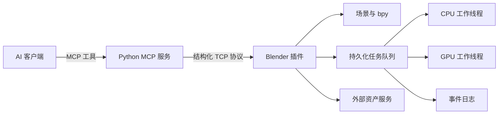

<div align="center">


### 构建世界。指挥 Blender。把不可能变成作品。

`精细建模` · `材质系统` · `动画制作` · `渲染烘焙` · `自动化生产`

[English](README.md) | [**简体中文**](README.zh-CN.md) | [日本語](README.ja.md)

[](https://github.com/XUJL-916/blender-mcp-enhanced/releases)
[](docs/COMPATIBILITY_BLENDER_5_1_2.md)
[](tests)
[](LICENSE)

</div>


> **Blender MCP Enhanced** 将 Blender 变成面向 AI Agent 的 3D 生产环境。
> AI 客户端通过 Model Context Protocol 调用结构化工具，本地 Blender 插件负责
> 真正执行建模、材质、动画、渲染、资产处理和可恢复的后台任务。

顶部封面是项目概念视觉；下方展示的图片全部来自本项目开发和测试过程中创建的
真实 `.blend` 场景与渲染结果。

## 看它开始建造

<div align="center">
  <a href="assets/showcase/showreel.mp4">
    
  </a>
  <br />
  <sub>点击动图可查看轻量 MP4 版本。</sub>
</div>

<br />

<table>
  <tr>
    <td width="50%" align="center">
      
      <br /><strong>霓虹未来城市</strong><br />
      程序化城市群、发光建筑、灯光与电影机位。<br />
      <a href="mcp_future_city.blend">打开 .blend 场景</a>
    </td>
    <td width="50%" align="center">
      
      <br /><strong>蓝调时刻的南昌</strong><br />
      现代天际线、城市水岸与传统楼阁的组合研究。<br />
      <a href="nanchang_city.blend">打开 .blend 场景</a>
    </td>
  </tr>
  <tr>
    <td colspan="2" align="center">
      
      <br /><strong>精细人物模型</strong><br />
      多层硬表面结构、材质、棚拍灯光与近景细节。<br />
      <a href="detailed_character.blend">打开 .blend 场景</a>
    </td>
  </tr>
</table>

## 为什么选择这个增强版

| 方向 | 已实现能力 |
|---|---|
| 结构化建模 | 网格编辑、修改器、雕刻辅助、UV、布尔、曲线、文字与空间测量 |
| 视觉开发 | PBR 材质、完整节点图编辑、灯光预设、渲染通道与合成器控制 |
| 动画制作 | 关键帧、Action、约束、骨架、人物绑定与 Blender 5.x FCurve 兼容 |
| 场景生产 | 相机、集合、导入导出、资源打包、清理、快照、差异比较与事务回滚 |
| 长时间任务 | 异步渲染、烘焙与下载，支持暂停恢复、优先级、重试和重启恢复 |
| 工作流编排 | 依赖 DAG、CPU/GPU 资源槽、持久化事件游标与结构化错误 |
| 资产生态 | Poly Haven、Sketchfab、BlenderKit、Hyper3D 与 Hunyuan3D 接口 |

## 从一句描述开始

```text
建立一个蓝调时刻的南昌水岸场景。先完成城市体块，再加入传统楼阁、桥梁灯光、
河面反射和三个电影机位，最后使用 Cycles 渲染选中的视角。
```

```text
根据固定随机种子生成张家界风格的砂岩峰林，加入侵蚀遮罩、植被分布、悬崖步道、
大气透视，并在 GPU 并发限制为 1 的队列里渲染三个机位。
```

```text
从 DEM 高程数据建立特定地表，生成多个 LOD，烘焙法线与 AO，打包外部依赖，
最后导出经过清理的 GLB 文件。
```

## 系统架构



- 当前完整回归测试：**243 passed**。
- 请求与响应大小限制、敏感日志脱敏、结构化错误与自动重连。
- 用户上下文保护和支持回滚的多步骤建模配方。
- Blender 5.1.2 为主要验证目标，MCP 服务支持 Python 3.10+。

## 快速开始

### 1. 安装 Python 服务

```bash
git clone https://github.com/XUJL-916/blender-mcp-enhanced.git
cd blender-mcp-enhanced
uv sync
```

也可以在 Python 3.10+ 环境中执行 `pip install -e .`。

### 2. 安装 Blender 插件

1. 打开 **Blender > 编辑 > 偏好设置 > 插件**。
2. 选择 **从磁盘安装**，然后选择 [`addon.py`](addon.py)。
3. 启用 **Blender MCP**。
4. 在 Blender MCP 侧栏面板中启动本地服务，默认端口为 `9876`。

### 3. 配置 MCP 客户端

```json
{
  "mcpServers": {
    "blender": {
      "command": "uv",
      "args": [
        "--directory",
        "C:/你的绝对路径/blender-mcp-enhanced",
        "run",
        "blender-mcp"
      ]
    }
  }
}
```

调用 Blender 工具前，需要先启动 Blender 内的插件服务。

## 异步生产队列

长时间渲染、纹理烘焙和下载不会阻塞 Blender 主连接。任务支持进度、输出、
有界日志、持久化状态、依赖关系和独立 CPU/GPU 并发限制。

```text
submit_async_job(kind="render", priority=50, resource="gpu", ...)
pause_async_job(job_id="...")
resume_async_job(job_id="...")
get_async_job_graph()
subscribe_async_job_events(after=cursor)
```

完整说明请阅读 [生产工作流](docs/PRODUCTION_WORKFLOWS.md)。

## 文档入口

| 文档 | 内容 |
|---|---|
| [用户指南](docs/USER_GUIDE.md) | 安装和日常工作流 |
| [API 文档](docs/API_DOCUMENTATION.md) | 工具与协议参考 |
| [精细建模](docs/FINE_MODELING.md) | 精确建模接口 |
| [生产工作流](docs/PRODUCTION_WORKFLOWS.md) | 队列、回滚、渲染与资源打包 |
| [Blender 5.1 兼容性](docs/COMPATIBILITY_BLENDER_5_1_2.md) | 已验证 API 行为 |
| [故障排查](docs/TROUBLESHOOTING.md) | 连接和运行时诊断 |
| [开发者指南](docs/DEVELOPER_GUIDE.md) | 架构与贡献说明 |

## 安全说明

这是一个能力很强的本地自动化桥接层。`execute_blender_code` 可以在 Blender
内部执行 Python，任务工具也能够访问本地路径。请只在可信环境中运行，不要将
Blender TCP 服务直接暴露到公网，也不要提交任何 API Key。

## 致谢与许可

本项目基于 [MIT License](LICENSE) 发布，建立在
[Siddharth Ahuja / ahujasid](https://github.com/ahujasid/blender-mcp) 的原始工作
以及 Blender MCP 社区贡献之上。

<div align="center">

**从一个物体到一整个世界，让创造始终留在 Blender 里。**

[提交问题](https://github.com/XUJL-916/blender-mcp-enhanced/issues) ·
[阅读文档](docs/USER_GUIDE.md) ·
[观看演示](assets/showcase/showreel.mp4)

</div>
